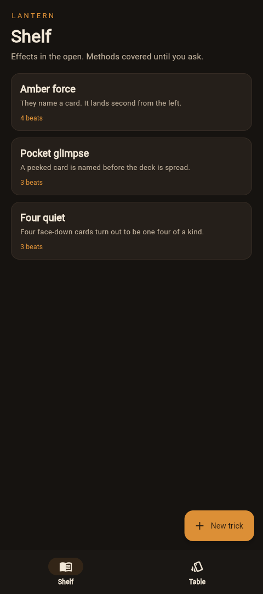

# Lantern

Pocket notes for close-up card work. The shelf holds the effect. The method stays covered until you uncover it. On the felt, five cards are dealt so a force can be rehearsed: with control on, the named card sits second from the left.

A fresh install starts with three tricks. Edit them or remove them.



## Run

```bash
flutter pub get
flutter run
```

On a Mac, `flutter run -d macos` opens the desktop app.

## Test

```bash
flutter test
flutter test integration_test/journey_test.dart -d macos
```

The shelf is stored in the application support directory. The web build keeps the same shelf in memory for the session.
